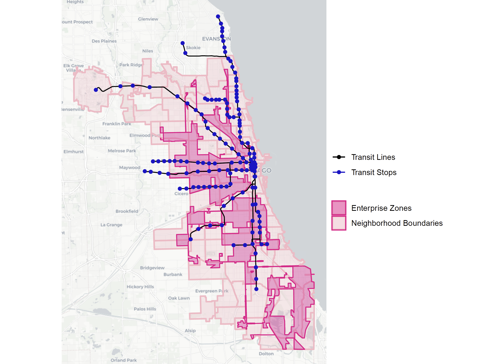

```{r setup, include=FALSE}
knitr::opts_chunk$set(echo = TRUE)
```


This is an example of a portfolio that someone might assemble to demonstrate the skills they have developed in VIS 2128. I have created this page using RMarkdown. There are fancier tools out there for creating and hosting webpages, and you are welcome to use any of those if you like. The advantage of this approach is that you can create your webpage directly from RStudio.

This example uses the `journal` theme, which is available by default.

There are 12 themes available by default: `cerulean`, `cosmo`, `flatly`, `journal`, `lumen`, `paper`, `readable`, `sandstone`, `simplex`, `spacelab`, `united`, and `yeti`.

Your portfolio should demonstrate each of the following skills (not all of which are demonstrated in this example):

* Displaying multiple vector layers on the same map
* Calculating and displaying relationships among point and polygon layers based on distance
* Aggregating point data to a layer of polygons
* Calculating and displaying accessibility, based on travel time
* Converting between raster layers and vector layers
* Displaying raster data on a map
* Georeferencing a raster image
* Displaying data on an interactive map

# City of Chicago
The first city I chose to explore using R was that of Chicago. Of special interest was the The Chicago Enterprise Zones Program which offers state and local tax incentives to encourage companies to locate their business in depressed areas of the city. The program aims to stimulate economic and neighborhood growth in six designated zones. 

Exploring these zones through a transportation lens reveals a substantial gap in transportation investment in these zones that could limit the potential of the City’s investment in the program.

As the visualizations below illustrate, many of these zones are located in regions of the city with limited or no transit stops. For example, Zone 3, on the South Side of Chicago, one of the largest Enterprise Zones identified in the program, is not connected to any transit stop on Chicago’s ‘L’ line.

Interestingly enough, when this analysis was first undertaken to prove that Chicago’s Enterprise Zones program must consider transit access in the six zones in order to be effective, we did not have knowledge of the tidytransit package or aggregation commands we learned soon after. I believe, I can now visually illustrate this analysis in more depth, given the skillsets picked up and shown in the rest of this portfolio.

### The Chicago Enterprize Zones Program

[](https://github.com/AeshnaPrasad/Final-Portfolio/fullsize/chicago.pdf){target="_blank"}

This map demonstrates the following skills: 

* Displaying multiple vector layers on the same map (points, polygons, and lines).


# City of Venice
The next city of interest was that of Venice, Italy. Given the assignment - which required us to visit the Harvard Maps Collection and chose a historical map to georeference, I felt like Venice would over beautiful possibilities, which it did. Not only did we collaborate with the Maps Collection to stitch 8 panels that had never been seen together as a map, we also overlaid data about sea-level rise to render visible the effects of climate change to ourselves and others. 

The most interesting insights to me were that Venice has added a lot of land mass over the last century and most of it is higher actually, thus unlikely to flood. More importantly, what was concerning was that I realized that most of the buildings that were expected to flood in a 1 meter sea level rise scenario, were public structures of historical, architectural and cultural significance.(colored in red)


### Sea-Level Rise is Real!

[](https://github.com/AeshnaPrasad/Final-Portfolio/fullsize/venice.pdf){target="_blank"}

This map demonstrates the following skills:

* Georeferencing a raster image
* Displaying multiple vector layers on the same map


# City of San Francisco
San Francisco city has most recently been pushing various of green and sustainable initiatives given the city's current plight and challenges. Of special interest to us was which neighborhoods were truly working towards this aspiration of the city. In order to better understand the story, I chose to analyze the number and density of urban (street) trees, parks and bike stations in various neighborhoods, and their relationships with each other. In my opinion, this reveals trends in investment in increasing their green footprint and in sustainable modes of transport - biking. 

The analysis also recognizes the difference between parks and urban trees as an investments and each of their benefits The last map in this series explicitly looks to quantify how many urban trees are located within a 100 m radius of a bike station for it aims to render visible, the importance of thinking of such things in conjunction and their ability to influence user patterns and sustainability.

### Green and Sustainable San Francisco: Yay or Nay?

The first map displayed below is a visualization of all data used in the analysis of SF as discussed above.

[](https://github.com/AeshnaPrasad/Final-Portfolio/fullsize/SF1.pdf){target="_blank"}

Through spatial analysis I created the following 6 maps and gleaned insights such as:

###### 1) Average number of urban trees  in each SF Neighborhood = 1644.744

[](https://github.com/AeshnaPrasad/Final-Portfolio/fullsize/SF2.pdf){target="_blank"}

###### 2) Average density of Urban Trees in each SF Neighborhood = 2002.691 / sq.km

[](https://github.com/AeshnaPrasad/Final-Portfolio/fullsize/SF3.pdf){target="_blank"}

###### 3) Average number of Bike Stations in each SF Neighborhood = 1.401.

[](https://github.com/AeshnaPrasad/Final-Portfolio/fullsize/SF4.pdf){target="_blank"}

###### 4) Average density of Bike Station in each SF Neighborhood = 2.14 / sq.km

[](https://github.com/AeshnaPrasad/Final-Portfolio/fullsize/SF5.pdf){target="_blank"}

###### 5) Number & proportion of Neighborhoods that have Parks in them = 45 of 117 = 38.46%

[](https://github.com/AeshnaPrasad/Final-Portfolio/fullsize/SF6.pdf){target="_blank"}

###### 6) Number & proportion of Urban Trees within 100m of Bike Stations = 4658 of 50000 = 2%

[](https://github.com/AeshnaPrasad/Final-Portfolio/fullsize/SF7.pdf){target="_blank"}


These maps demonstrate the following skills:

* Displaying multiple vector layers on the same map
* Calculating and displaying relationships among point and polygon layers based on distance
* Aggregating point data to a layer of polygons


# City of Detroit
The legacy of Detroit as a rust-belt city and the many woes that followed after the suburban flight from it make it a very particular and exciting place to be studying. For the accesSiblity and travel time analysis project, I therefore decided to study the city given it's auto-dominated environment in both industry and in its built form. As the city tries to re-cast itself in a more equitable and environmentally-sustainable way, a focus on stronger neighborhood-level educational institutions and expansion of alternative transportation systems are necessary. Thus, I decided to take a deep-dive and began mapping the relative locations and accessibility of kindergartens and schools using a bicycle.


### Can I Bike to Learn in Detroit?
In order to answer this question I first mapped the location of kindergartens and schools in the city as seen in the 2 maps below.

###### Kindergartens

[](https://github.com/AeshnaPrasad/Final-Portfolio/fullsize/D3.pdf){target="_blank"}

[](https://github.com/AeshnaPrasad/Final-Portfolio/fullsize/D4.pdf){target="_blank"}

###### Schools

[](https://github.com/AeshnaPrasad/Final-Portfolio/fullsize/D7.pdf){target="_blank"}

[](https://github.com/AeshnaPrasad/Final-Portfolio/fullsize/D8.pdf){target="_blank"}

Plotted above is the location of the education institutes under our analysis located within the city limits. At first look, schools seem equitably distributed throughout the city’s gridded street infrastructure and neighborhoods but the kindergartens seem very sparsely distributed to the outskirts.
I also created iso-chrome maps to understand the walk times to kindergartens from different neighborhoods and bicycle times to schools similarly.

Following this, I focused in only accessibility and transit times for schools alone. Below is the location and number of schools as distributed across the city of Detroit.

[](https://github.com/AeshnaPrasad/Final-Portfolio/fullsize/D9.pdf){target="_blank"}

To decode accessibility of schools by bicycles I created two maps - one which looks at number of schools that can be accessed within a 20 minute bike ride and the other which provides an accessibility score to various places based on this.

[](https://github.com/AeshnaPrasad/Final-Portfolio/fullsize/D10.pdf){target="_blank"}

[](https://github.com/AeshnaPrasad/Final-Portfolio/fullsize/D11.pdf){target="_blank"}

###### Raster Maps showing bike accesibility to schools

All the maps below show similar information as seen in the vector maps above but the exercise allowed me to see the different ways in which the same data can be displayed and conveyed which was creatively very satisfying.

[](https://github.com/AeshnaPrasad/Final-Portfolio/fullsize/D11A.pdf){target="_blank"}

[](https://github.com/AeshnaPrasad/Final-Portfolio/fullsize/D12.pdf){target="_blank"}

[](https://github.com/AeshnaPrasad/Final-Portfolio/fullsize/D13.pdf){target="_blank"}

[](https://github.com/AeshnaPrasad/Final-Portfolio/fullsize/D14.pdf){target="_blank"}

[](https://github.com/AeshnaPrasad/Final-Portfolio/fullsize/D15.pdf){target="_blank"}


These maps demonstrate the following skills:

* Displaying multiple vector layers on the same map
* Calculating and displaying relationships among point and polygon layers based on distance
* Aggregating point data to a layer of polygons
* Calculating and displaying accessibility, based on travel time
* Converting between raster layers and vector layers
* Displaying raster data on a map


# City of New York
The last city I chose to analyse, in order to create an interactive map was the city of New York. Having gone through so many interesting United State cities, it felt wrong to leave this one out of the series. More importantly, given the conversations around immigration in recent years, while looking through the data, my attention fell upon the foreign-born data.

Thus, this map looks to understand what percentage of residents in the Five Boroughs of New York come from outside the United States, ie - are foreigners. I chose to do the 5 given I wanted to try and see if there was a comparison that could be set up, however, interesting to note is that the data does not allow for the same. Using the census tracts enables us to at least see what areas in the city have a major concentration of international citizens. Worth noting is that the assumption was Manhattan or New York County would have maximum percentage of foreign born but Brooklyn and Queens seem to have more percent concentration, that is not to say their constant numbers are higher. The map invites you to explore this observation and your areas of interest to understand composition of citizenry.


### New York: A City of "Outsiders"?

[](https://github.com/AeshnaPrasad/Final-Portfolio/fullsize/NYC.html){target="_blank"}

This map demonstrate the following skills:
* Displaying data on an interactive map